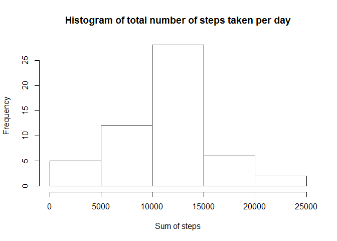
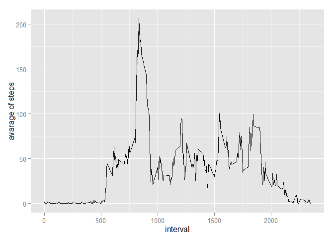
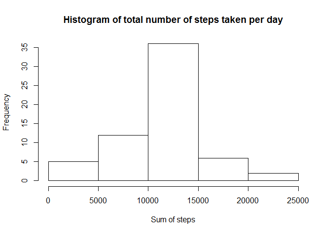
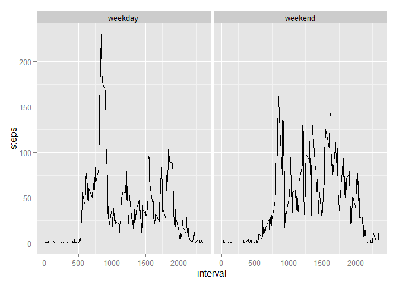

# Reproducible Research: Peer Assessment 1
Łukasz Grzybowski  


### Loading and preprocessing the data

```r
data<-read.csv(unzip("activity.zip","activity.csv"))
```

### What is mean total number of steps taken per day?

```r
library(dplyr)
sum<-data %>% group_by(date) %>% summarise(stepsSum=sum(steps))
hist(sum$stepsSum,main="Histogram of total number of steps taken per day",xlab = "Sum of steps")
```

 

```r
mean(sum$stepsSum,na.rm = TRUE)
```

```
## [1] 10766.19
```

```r
median(sum$stepsSum,na.rm = TRUE)
```

```
## [1] 10765
```
-  The mean of total number of steps per day is 10766.19
-  The median of total number of steps per day is 10765

### What is the average daily activity pattern?

```r
library(ggplot2)
stepsMean<-data %>% group_by(interval) %>% summarise(steps=mean(steps,na.rm = TRUE))
plot<-ggplot(data=stepsMean,aes(x=interval,y=steps))
plot+geom_line()+ylab(label = "avarage of steps")
```

 

```r
stepsMean[which.max(stepsMean$steps), ]$interval
```

```
## [1] 835
```
- Maximum number of steps contains 835 interval

### Imputing missing values

1. Number of rows with missing values 

```r
sum(!complete.cases(data))
```

```
## [1] 2304
```
- 2304 rows have missing values

2. Impute missing values
- Missing data are impute by mean for interval as below:

```r
imputedData<-data

#calculate mean for interval
myImput<-function(intervalToFind){
  subset<-filter(data,interval==intervalToFind)
  return(mean(subset$steps,na.rm = TRUE))
}

#find na and replace by mean for interval
for(i in 1:nrow(imputedData)){
 if(is.na(imputedData[i,1])){
  imputedData[i,1] <- myImput(imputedData[i,3])
 }
}

sum<-imputedData %>% group_by(date) %>% summarise(stepsSum=sum(steps))
hist(sum$stepsSum,main="Histogram of total number of steps taken per day",xlab = "Sum of steps")
```

 

```r
mean(sum$stepsSum,na.rm = TRUE)
```

```
## [1] 10766.19
```

```r
median(sum$stepsSum,na.rm = TRUE)  
```

```
## [1] 10766.19
```
- Mean and median of total number of steps per day are equals
- Mean value is the same as before
- Median value is a little bit higher than before


### Are there differences in activity patterns between weekdays and weekends?

```r
Sys.setlocale("LC_TIME", "English")
```

```
## [1] "English_United States.1252"
```

```r
imputedData$day<-weekdays(as.Date(imputedData$date),abbreviate=TRUE)
imputedData$day<-factor(ifelse(imputedData$day %in% c("Sun","Sat"),yes = "weekend",no = "weekday"))
stepsMean<-imputedData %>% group_by(interval,day) %>% summarise(steps=mean(steps,na.rm = TRUE))
ggplot(data=stepsMean,aes(x=interval,y=steps))+geom_line()+facet_wrap(~day)
```

 
